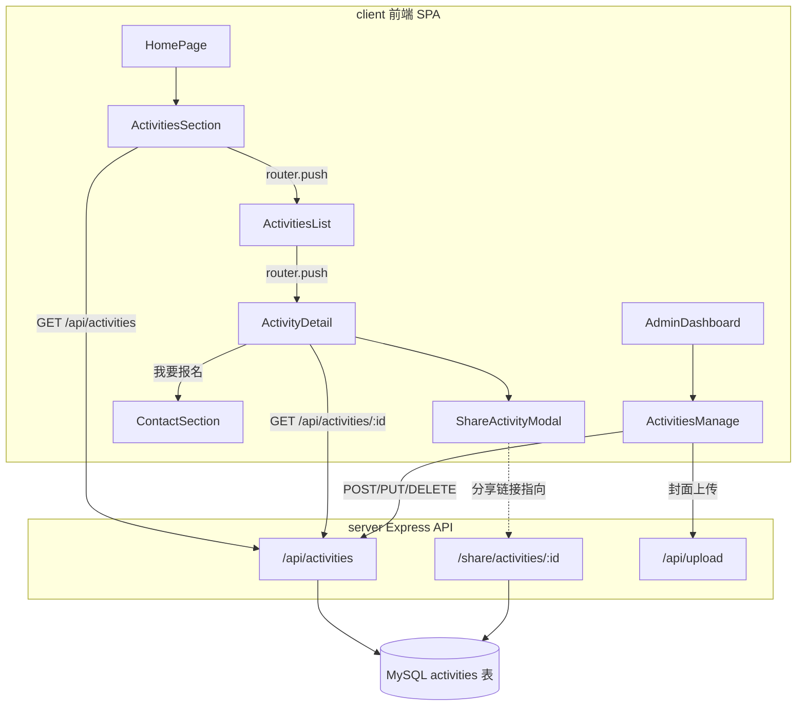

# v1.1 程序设计：活动模块

配套文档：[00-规划.md](./00-规划.md)（背景与产品决策，请先阅读）

## 1. 总体架构



## 2. 数据库设计

新增表 `activities`（在 `server/db.js` 的 `createTables()` 中追加）：

```sql
CREATE TABLE IF NOT EXISTS activities (
  id INT AUTO_INCREMENT PRIMARY KEY,
  title VARCHAR(255) NOT NULL,
  summary VARCHAR(500),
  content TEXT,
  cover_image_url TEXT,
  location VARCHAR(255),
  start_time DATETIME,
  end_time DATETIME,
  status VARCHAR(20) DEFAULT 'draft',
  sort_order INT DEFAULT 0,
  view_count INT DEFAULT 0,
  created_at DATETIME DEFAULT CURRENT_TIMESTAMP,
  updated_at DATETIME DEFAULT CURRENT_TIMESTAMP ON UPDATE CURRENT_TIMESTAMP
) ENGINE=InnoDB DEFAULT CHARSET=utf8mb4;
```

字段说明：

| 字段 | 类型 | 说明 |
|------|------|------|
| `title` | VARCHAR(255) | 活动标题，必填 |
| `summary` | VARCHAR(500) | 列表卡片摘要 + 分享卡片 `og:description` |
| `content` | TEXT | 详情正文，允许简单 HTML（后台用 textarea，先不引入富文本编辑器） |
| `cover_image_url` | TEXT | 封面图，通过 `POST /api/upload` 上传后回填 |
| `location` | VARCHAR(255) | 活动地点，选填 |
| `start_time` / `end_time` | DATETIME | 活动起止时间，选填（长期活动可只填 start_time） |
| `status` | VARCHAR(20) | `draft`（草稿，前台不可见）/ `published`（已发布）/ `ended`（已结束，前台仍可见但标记"已结束"） |
| `sort_order` | INT | 排序权重，越小越靠前，默认 0 |
| `view_count` | INT | 详情/分享页访问次数，简单自增，不做去重统计 |

种子数据：不强制要求，可选在 `initDatabase()` 里按 `COUNT(*) = 0` 插入 1~2 条示例活动，便于本地验证。

## 3. 后端 API 设计

新文件 `server/routes/activities.js`，响应格式统一遵循现有约定 `{ code, message, data }`。

### 3.1 公开接口

**`GET /api/activities`** — 活动列表

- Query 参数：`status`（可选，默认仅返回 `published` 和 `ended`；不传则前台展示态，管理端另走鉴权列表见下）
- 排序：`ORDER BY sort_order ASC, start_time DESC`
- 响应示例：

```json
{
  "code": 200,
  "message": "success",
  "data": [
    {
      "id": 3,
      "title": "2026 秋季新品发布会",
      "summary": "邀您共赏年度新品设计",
      "cover_image_url": "/uploads/xxx.png",
      "location": "上海展厅",
      "start_time": "2026-09-10 14:00:00",
      "end_time": "2026-09-10 17:00:00",
      "status": "published",
      "sort_order": 0
    }
  ]
}
```

**`GET /api/activities/:id`** — 活动详情（公开，命中后 `UPDATE activities SET view_count = view_count + 1 WHERE id = ?`）

- 若 `status = draft` 且请求未携带管理员 token，返回 `404`（草稿不对外暴露）
- 响应包含全部字段（含 `content`、`view_count`）

### 3.2 管理端接口（`authMiddleware + requireRole('admin')`）

| 方法 | 路径 | 说明 |
|------|------|------|
| `GET` | `/api/activities/admin/list` | 管理端列表，不过滤 `status`，用于后台表格展示全部（含草稿） |
| `POST` | `/api/activities` | 创建活动 |
| `PUT` | `/api/activities/:id` | 更新活动（字段用 `??` 保留原值，参考 `cases.js` 写法） |
| `DELETE` | `/api/activities/:id` | 删除活动 |

> 说明：`GET /` 与 `GET /admin/list` 分开，避免路由参数 `:id` 与 `admin` 字符串冲突；Express 路由需将 `/admin/list` 定义在 `/:id` 之前。

创建/更新请求体示例：

```json
{
  "title": "2026 秋季新品发布会",
  "summary": "邀您共赏年度新品设计",
  "content": "<p>活动详情正文...</p>",
  "cover_image_url": "/uploads/xxx.png",
  "location": "上海展厅",
  "start_time": "2026-09-10 14:00:00",
  "end_time": "2026-09-10 17:00:00",
  "status": "published",
  "sort_order": 0
}
```

### 3.3 路由挂载

`server/index.js` 中追加：

```js
const activitiesRoutes = require('./routes/activities');
app.use('/api/activities', activitiesRoutes);
```

## 4. 分享落地页设计（SSR-lite）

新文件 `server/routes/share.js`，挂载：

```js
const shareRoutes = require('./routes/share');
app.use('/share', shareRoutes);
```

**`GET /share/activities/:id`**

处理流程：

1. 查询 `activities` 表，若不存在或 `status = draft` → 返回一个"活动不存在/已下线"的通用 HTML（同样带基础 meta，避免 404 裸奔）
2. 命中则 `view_count + 1`
3. 用字符串模板（或引入 `ejs`，`server/views/activity-share.ejs`）拼接 HTML，关键 meta 映射：

| 数据字段 | HTML 输出 |
|----------|-----------|
| `title` | `<title>{title} - 尚润装饰</title>` + `<meta property="og:title" content="{title}">` |
| `summary` | `<meta property="og:description" content="{summary}">` + `<meta name="description" content="{summary}">` |
| `cover_image_url` | `<meta property="og:image" content="{绝对URL}">`（需要用请求 `req.protocol://req.get('host')` 或环境变量 `SITE_URL` 拼成绝对地址，社交平台不认相对路径） |
| — | `<meta property="og:type" content="article">` |
| — | `<meta property="og:url" content="{当前分享页完整URL}">` |

4. 页面 `<body>` 直出服务端渲染的内容块：封面图、标题、时间地点（`start_time`~`end_time` 格式化）、正文（`content` 原样输出，需对写入时的内容做基本转义防 XSS，或后台录入时只允许有限标签）、两个 CTA 按钮：
   - "进入官网查看更多活动" → `{SITE_URL}/#/activities/{id}`
   - "联系咨询" → `{SITE_URL}/#/#contact`
5. 响应头设置 `Content-Type: text/html; charset=utf-8`，不需要 JS、不引入 Vue，纯服务端字符串输出，保证爬虫/微信不执行 JS 也能拿到正确内容。

安全与配置：

- 新增环境变量 `SITE_URL`（已有维护脚本 `generateSiteQr.js` 用过同名变量，保持一致），用于拼接 `og:image`、跳转链接的绝对地址；未设置时 fallback 到 `${req.protocol}://${req.get('host')}`
- `content` 字段展示前统一做一次 HTML 转义再替换少量安全标签（或后台录入限制为纯文本 + 手动换行），避免存储型 XSS

## 5. 二维码与分享海报设计

- 二维码：前端新增依赖 `qrcode`（`npm install qrcode`），在 `ShareActivityModal.vue` 中用 `QRCode.toDataURL(shareUrl)` 现场生成 `` 展示，支持"保存二维码图片"
- 分享链接：`shareUrl = `${window.location.origin}/share/activities/${activity.id}``
- 分享海报（可选增强）：仿照 `client/src/utils/poster.js` 的 `generateCasePoster`，新增 `generateActivityPoster(activity, { qrDataUrl, ...options })`，画布布局与案例海报一致（封面图 + 标题 + 摘要 + 二维码），二维码直接用上面生成的 DataURL 通过 `loadImage()` 绘入 Canvas，不需要额外请求

## 6. 前端设计

### 6.1 路由表（`client/src/router/index.js`）

| 路径 | name | 组件 | 鉴权 |
|------|------|------|------|
| `/activities` | `ActivitiesList` | `views/ActivitiesList.vue` | 无 |
| `/activities/:id` | `ActivityDetail` | `views/ActivityDetail.vue`（`props: true`） | 无 |
| `/admin/activities` | `ActivitiesManage` | `views/admin/ActivitiesManage.vue`（`/admin` 子路由） | `requiresAuth`（跟随现有 `/admin` 父路由 `meta`） |

### 6.2 Store：`client/src/stores/activities.js`

```js
export const useActivitiesStore = defineStore('activities', () => {
  const items = ref([])
  const current = ref(null)

  async function fetchAll(params) {
    const res = await request.get('/activities', { params })
    if (res.code === 200) items.value = res.data
    return res
  }

  async function fetchAdminList() {
    const res = await request.get('/activities/admin/list')
    if (res.code === 200) items.value = res.data
    return res
  }

  async function fetchOne(id) {
    const res = await request.get(`/activities/${id}`)
    if (res.code === 200) current.value = res.data
    return res
  }

  async function create(payload) { return request.post('/activities', payload) }
  async function update(id, payload) { return request.put(`/activities/${id}`, payload) }
  async function remove(id) { return request.delete(`/activities/${id}`) }

  return { items, current, fetchAll, fetchAdminList, fetchOne, create, update, remove }
})
```

### 6.3 `components/sections/ActivitiesSection.vue`（首页展示）

- `id="activities"`，参考 `CasesSection.vue` 卡片网格样式
- `onMounted` 调 `activitiesStore.fetchAll({ status: 'published' })`，取前 6 条展示
- 卡片点击 → `router.push(\`/activities/${item.id}\`)`
- 区块底部按钮"查看全部活动" → `router.push('/activities')`
- `Navbar.vue` 的 `navLinks` 增加 `{ label: '活动', href: '#activities' }`
- `HomePage.vue` 在 `<CasesSection />` 之后插入 `<ActivitiesSection />`

### 6.4 `views/ActivitiesList.vue`

- 公开访问，无需登录
- `onMounted` 调 `fetchAll({ status: 'published' })`
- 卡片网格 + 简单状态标签（进行中/已结束，前端按 `start_time`/`end_time`/`status` 计算展示态）
- 点击卡片 → `router.push(\`/activities/${id}\`)`

### 6.5 `views/ActivityDetail.vue`

- Props：`{ id }`（同 `MaterialDetail.vue` 的 `props: true` 模式，兼容 `route.params.id` fallback）
- `onMounted` 调 `activitiesStore.fetchOne(id)`
- 页面结构：封面图 → 标题/时间/地点 → 正文（`content`，用 `v-html` 前需确认内容来源可信，即后台录入侧已做限制/转义）→ 操作区：「分享」「我要报名」
- 「分享」→ 打开 `ShareActivityModal`，传入 `activity` 与 `shareUrl`
- 「我要报名」→ `router.push({ path: '/', query: { activity: activity.title } })` 或复用 `HomePage.vue` 现有的 `preferredDesigner` 跨组件预填模式：若详情页与首页非同一路由实例，采用 query 参数或 Pinia 临时状态传递，`HomePage.vue` 挂载时读取并传给 `ContactSection`（`preferredActivity`），`ContactSection.vue` 表单留言框自动带上"咨询活动：{title}"

### 6.6 `components/ShareActivityModal.vue`

- Props：`visible`, `activity`
- 内容：
  - 分享链接文本框（只读）+「复制链接」按钮（`navigator.clipboard.writeText`）
  - 二维码图片（`qrcode` 库生成的 DataURL）+「保存二维码」按钮
  - 「生成分享海报」按钮（调用 `generateActivityPoster`，同 `SharePoster.vue` 的加载态/下载态处理）
- UI 风格与交互直接复用 `SharePoster.vue` 的 Modal 结构（遮罩层、Teleport to body、Transition）

### 6.7 后台管理 `views/admin/ActivitiesManage.vue`

- 结构参考 `CasesManage.vue`：表格 + 新建/编辑 Modal 表单
- 表格列：封面缩略图、标题、状态（下拉可快速切换 draft/published/ended）、时间、排序、浏览量、操作（编辑/删除/查看分享链接与二维码）
- 表单字段：标题、摘要、正文（textarea）、封面上传（复用 `utils/upload.js`）、地点、起止时间（`<input type="datetime-local">`）、状态、排序
- 「查看分享链接与二维码」操作直接复用 `ShareActivityModal.vue`，方便运营在后台就能拿到分享素材，无需先跳到前台详情页
- 侧边栏：`DashboardPage.vue` 的 `navItems` 增加 `{ path: '/admin/activities', label: '活动管理', icon: '🎉' }`

## 7. 依赖变更

| 包 | 位置 | 用途 |
|------|------|------|
| `qrcode` | `client/package.json` | 前端现场生成二维码 DataURL |
| `ejs`（可选） | `server/package.json` | 分享落地页模板渲染，若不引入则用字符串模板函数代替 |

## 8. 验证方式（本地）

1. `cd server && node index.js`，`cd client && npm run dev`
2. 后台创建一条 `status=published` 的活动，封面走 `/api/upload`
3. 首页滚动到"活动"Section，确认卡片展示、点击进入 `#/activities/:id` 详情
4. 详情页点击"分享"，确认二维码可生成、链接可复制
5. 直接浏览器访问复制到的 `http://localhost:5173/share/activities/1`（该路径在 server 侧，注意本地是 Vite 代理还是直连 3000 端口，需确认 `vite.config.js` 是否需要新增 `/share` 代理规则），检查页面源码 `view-source:` 确认 `<title>` 与 `og:image` 已替换为该活动的数据
6. 用 `curl -s http://localhost:3000/share/activities/1 | grep og:` 快速核对 meta 是否正确

> 注意：`client/vite.config.js` 当前只代理了 `/api` 与 `/uploads`，需要补充 `/share` 的代理规则，否则本地开发环境下通过 5173 端口访问 `/share/activities/:id` 会 404。

## 9. 整体项目架构升级建议（后续版本排期参考）

| # | 问题 | 建议 | 优先级建议 |
|---|------|------|------|
| 1 | `AGENTS.md` 描述 SQLite，实际是 MySQL + `deasync` | 更新文档口径 | 低 |
| 2 | `deasync` 同步化数据库调用阻塞事件循环 | 逐步改造为 Promise + `async/await`，移除 `deasync` | 高 |
| 3 | 权限模型不统一（`cases` 缺 `requireRole('admin')`） | 梳理权限矩阵，统一各资源写权限 | 高 |
| 4 | 无数据库迁移机制 | 引入轻量 migration 工具或版本号表 | 中 |
| 5 | 列表接口无分页/搜索 | 统一加 `LIMIT/OFFSET` 与关键字过滤 | 中 |
| 6 | 无自动化测试 | 核心路由补 `vitest + supertest` | 中 |
| 7 | 无 CI | 接入基础 lint + test + build 流水线 | 中 |
| 8 | 无 ESLint/Prettier | 引入 Vue3 官方推荐配置 | 低 |
| 9 | 后台无组件库，重复造轮子 | 评估 Element Plus 或抽通用 `AdminTable`/`AdminModal` | 中 |
| 10 | SPA 无 SSR/预渲染能力 | 规划统一"轻量 SSR/meta 注入网关"或迁移 Nuxt | 中（长期） |
| 11 | 上传文件存本地磁盘 | 评估迁移对象存储(OSS/S3) + CDN | 中（长期） |
| 12 | `JWT_SECRET` 硬编码默认值 | 生产环境启动时校验必需环境变量 | 高 |
| 13 | 前端缺统一请求态/错误处理 | `request.js` 层封装全局 loading/错误提示 | 低 |

本版本（v1.1）不处理以上升级项，仅作记录，供下一版本迭代排期时参考。
