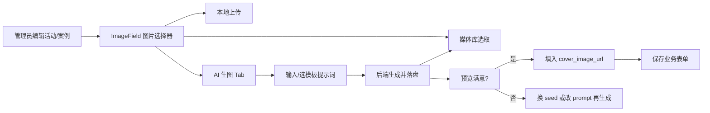

# v1.2 规划：AI 生图 + 媒体库 + 运营体验升级

> **状态：暂缓。** 优先实施 [02-首页模块展示管理-规划.md](./02-首页模块展示管理-规划.md)（首页各模块展示/隐藏开关）。AI 生图方案保留供后续排期。

v1.1 完成了活动模块（列表/详情/分享/后台管理），但运营侧有一个明显痛点：**图片从哪里来**。

当前现状：

| 来源 | 问题 |
|------|------|
| 种子 SVG（`server/uploads/seed/`） | 风格统一但偏模板化，促销/活动感不够强 |
| 本地上传 | 运营需自备素材，门槛高 |
| 手动填 URL | 外链不稳定，分享卡片 `og:image` 可能失效 |
| 设计师/案例/轮播/活动各自上传 | 没有统一入口，重复劳动，不知道「这张给哪用」 |

v1.2 的核心目标：**在后台提供一个「写提示词 → 生成图片 → 选用到具体位置」的闭环**，并顺带把 v1.1 遗留的高价值体验项排进同一版本。

---

## 版本目标（一句话）

> 让管理员不用找图，输入中文提示词即可生成并绑定到轮播、案例、活动、设计师等任意需要图片的地方；生成结果进入媒体库，可复用、可检索。

---

## 需求优先级

### P0 — 本版本必做（核心）

| # | 需求 | 说明 |
|---|------|------|
| 1 | **AI 生图能力** | 后台输入提示词，调用免费/低成本生图 API，生成图片并落盘到 `uploads/` |
| 2 | **统一图片选择器组件** | 各管理页（轮播/案例/活动/设计师/设置）共用：本地上传 + AI 生图 + 从媒体库选取 |
| 3 | **场景化尺寸预设** | 不同用途自动带推荐尺寸与提示词模板，减少运营试错 |
| 4 | **后端代理生图** | 不暴露第三方 API 细节给前端；生成后统一走现有 `persistUpload` 存储 |

### P1 — 本版本建议做（与 P0 强相关）

| # | 需求 | 说明 |
|---|------|------|
| 5 | **媒体库** | 记录所有上传/AI 生成的图片，支持标签、用途备注、预览、删除、一键复制 URL |
| 6 | **提示词模板库** | 内置「国庆促销」「现代客厅案例」「设计师形象」等模板，一键填入可改 |
| 7 | **生成历史** | 记录谁、何时、用什么 prompt 生成，方便复用 seed 出同款 |

### P2 — 可拆到 v1.2.x 或 v1.3

| # | 需求 | 说明 |
|---|------|------|
| 8 | 案例独立详情页 + 分享落地页 | 复用 v1.1 活动 `/share/cases/:id` 模式 |
| 9 | 线索管理增强 | 按活动/设计师来源筛选；导出含 `activity_title` |
| 10 | 活动/案例正文富文本 | 简易富文本或 Markdown 编辑器 |
| 11 | 后台通用组件抽取 | `AdminTable` / `AdminModal` / `ImageField` 减少重复代码 |
| 12 | 权限矩阵统一 | `cases` 写操作加 `requireRole('admin')` 等 |

### P3 — 架构债（记录，不阻塞 v1.2）

| # | 需求 | 来源 |
|---|------|------|
| 13 | 去掉 `deasync`，DB 改 async/await | v1.1 架构建议 #2 |
| 14 | 数据库 migration 机制 | v1.1 架构建议 #4 |
| 15 | 列表分页/搜索 | v1.1 架构建议 #5 |
| 16 | OSS/CDN + CI/测试 | v1.1 架构建议 #6-7、#11 |

---

## 核心方案：AI 生图

### 为什么必须走后端代理

1. **持久化**：Pollinations 等免费 API 返回的是 CDN 临时 URL，直接填进数据库会在分享/海报场景失效；必须下载后存入 `/uploads/`。
2. **限流控制**：免费 tier 有频率限制（如匿名约 15 秒/次），需在后端统一排队/限流，避免多人同时点爆。
3. **安全**：API Key（若注册免费账号）不应暴露在前端 bundle。
4. **统一格式**：生成后压缩为 JPG/WebP，与现有 `upload.js` 压缩策略一致。

### 推荐技术选型（免费优先）

| 方案 | 成本 | 优点 | 缺点 | 建议 |
|------|------|------|------|------|
| **Pollinations.AI** | 匿名免费；注册 Seed  tier 免费提频 | 无需 Key 可试用；URL 简单；支持 flux/turbo | 匿名限流严；商业授权需自查；服务稳定性非 SLA | **v1.2 默认方案** |
| Pollinations `gen.pollinations.ai` + 免费 Key | 注册后送 Pollen 额度 | 更稳定、可 scoped key | 需注册；额度用完要充值 | 生产环境备选 |
| Hugging Face Inference API | 免费 tier 有限 | 模型多 | 需 HF Token；集成稍复杂 | 备选 |
| 自建 ComfyUI / SD | 服务器 GPU 成本 | 完全可控 | 运维重 | 不推荐现阶段 |

**v1.2 决策**：默认对接 Pollinations 图片端点，通过后端 `POST /api/ai/generate-image` 代理；环境变量 `POLLINATIONS_API_KEY` 可选（有则走新 unified API，无则走 legacy URL）。

### 场景预设（「给哪用啥」）

| 场景 ID | 用途 | 推荐尺寸 | 默认提示词方向 |
|---------|------|----------|----------------|
| `banner` | 首页轮播 | 1920×900 | 宽屏家装宣传、品牌感、留文字区域 |
| `case` | 案例封面 | 1200×800 | 室内装修实景风、指定风格（现代/中式/轻奢） |
| `activity` | 活动封面 | 1200×630 | 促销海报风、节日/价格突出 |
| `designer` | 设计师头像 | 400×400 | 职业形象、中性背景、非真实名人 |
| `wechat_qr` | 二维码占位图 | 400×400 | 不适用 AI，仅上传 |
| `general` | 通用 | 1024×1024 | 自由描述 |

各管理页嵌入图片选择器时传入 `scene="activity"` 等，自动带出尺寸与模板。

### 用户流程（运营视角）

---

## 媒体库（P1）

解决「生成完不知道在哪、能不能复用」的问题。

- 入口：后台侧边栏「媒体库」
- 数据来源：所有 `/api/upload` 上传 + 所有 AI 生成结果，写入 `media_assets` 表
- 字段：url、filename、source（upload/ai）、prompt、scene、width、height、created_by、tags、used_in（可选 JSON：记录在哪些业务实体用过）
- 能力：网格预览、按来源/场景筛选、搜索 prompt、删除（软删）、复制链接

---

## 其他体验增强（P2 摘要）

### 案例独立详情 + 分享

与活动对齐：前台 `#/cases/:id` + 分享页 `/share/cases/:id`（SSR meta），案例卡片不再只能跳外链。

### 线索管理

联系表单已支持 `activity_title`；后台线索列表增加「来源活动」列与筛选。

### 后台 UI

v1.1 有 13+ 管理页手写表格/弹窗；v1.2 至少抽出 `ImageField.vue`，减少 5 处重复上传逻辑。

---

## 范围边界

| 做 | 不做 |
|----|------|
| AI 文生图（提示词 → 图片） | AI 图生图、局部重绘、抠图 |
| 媒体库增删查、选用 | 复杂 DAM（版本管理、审批流） |
| 后端限流 + 落盘 | 前端直连 Pollinations 作为唯一存储 |
| 场景预设 + 提示词模板 | 全自动「根据标题生成正文+配图」 |
| 可选免费 API Key 配置 | 自建 GPU 推理服务 |

---

## 风险与对策

| 风险 | 对策 |
|------|------|
| 免费 API 不稳定/限流 | 后端队列 + 友好错误提示；支持配置 Key；保留本地上传 |
| 生成内容不合规 | 提示词敏感词过滤；仅 admin 可用；生成图不入公共 feed |
| 商业授权模糊 | 文档注明「对外印刷/广告需自查模型许可」；优先用于网站展示 |
| 生成图偏「AI 感」 | 提供写实风 prompt 模板；scene 默认加 "photorealistic interior design" |
| 存储膨胀 | 媒体库软删 + 定期清理未引用资源（v1.2.x） |

---

## 验收标准（P0）

1. 活动管理编辑页可点「AI 生图」，输入「国庆红色促销海报，1元抵1000」→ 10–30 秒内预览 → 确认后 `cover_image_url` 自动填入
2. 生成的图片 URL 为 `/uploads/xxx.jpg`，刷新后仍在；分享页 `og:image` 可正常抓取
3. 案例/轮播/设计师管理页同样可用同一组件
4. 无 API Key 时本地/测试环境可完成至少 1 张生成（接受限流等待）
5. 媒体库可看到刚生成的记录及 prompt

---

## 文档索引

- 详细程序设计见 [01-程序设计.md](./01-程序设计.md)
- 上一版本见 [../1.1/00-规划.md](../1.1/00-规划.md)
