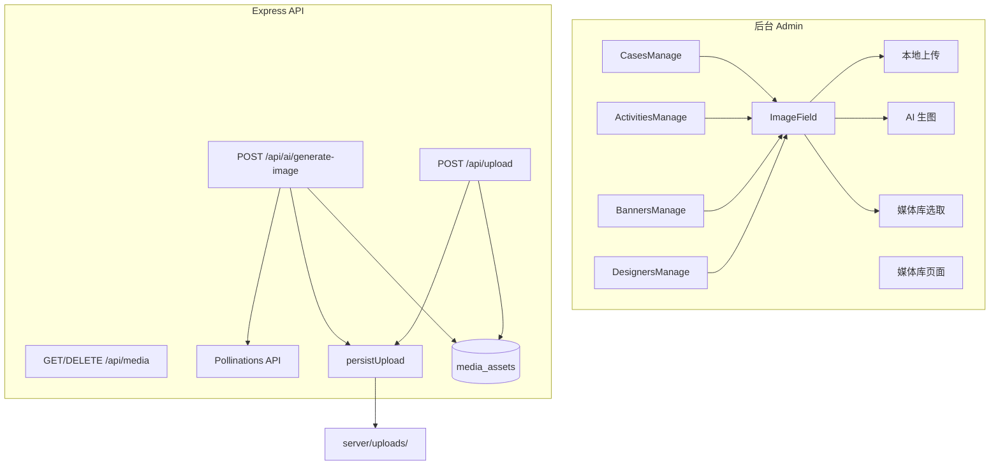

# v1.2 程序设计：AI 生图 + 媒体库

配套文档：[00-规划.md](./00-规划.md)

---

## 1. 总体架构



---

## 2. 数据库设计

### 2.1 新增表 `media_assets`

```sql
CREATE TABLE IF NOT EXISTS media_assets (
  id INT AUTO_INCREMENT PRIMARY KEY,
  url TEXT NOT NULL,
  filename VARCHAR(255),
  mime_type VARCHAR(100) DEFAULT 'image/jpeg',
  file_size INT DEFAULT 0,
  width INT,
  height INT,
  source VARCHAR(20) NOT NULL DEFAULT 'upload',
  scene VARCHAR(50),
  prompt TEXT,
  seed INT,
  model VARCHAR(50),
  tags VARCHAR(500),
  created_by INT,
  is_deleted TINYINT DEFAULT 0,
  created_at DATETIME DEFAULT CURRENT_TIMESTAMP,
  FOREIGN KEY (created_by) REFERENCES users(id)
) ENGINE=InnoDB DEFAULT CHARSET=utf8mb4;
```

| 字段 | 说明 |
|------|------|
| `source` | `upload` / `ai` |
| `scene` | `banner` / `case` / `activity` / `designer` / `general` |
| `prompt` | AI 生成时的完整提示词（上传为空） |
| `seed` | 复现同图用；上传为空 |
| `model` | 如 `flux`、`turbo` |
| `tags` | 逗号分隔，运营可手打「国庆」「客厅」 |

### 2.2 可选：AI 生成限流记录 `ai_generation_logs`

```sql
CREATE TABLE IF NOT EXISTS ai_generation_logs (
  id INT AUTO_INCREMENT PRIMARY KEY,
  user_id INT,
  prompt TEXT,
  scene VARCHAR(50),
  status VARCHAR(20),
  error_message TEXT,
  media_asset_id INT,
  duration_ms INT,
  created_at DATETIME DEFAULT CURRENT_TIMESTAMP
) ENGINE=InnoDB DEFAULT CHARSET=utf8mb4;
```

用于审计、排查失败、统计每日生成次数。

---

## 3. 后端 API 设计

### 3.1 `POST /api/ai/generate-image`

**鉴权**：`authMiddleware + requireRole('admin')`

**请求体**：

```json
{
  "prompt": "国庆红色家装促销海报，金色大字1元抵1000，现代简约风格，高清",
  "scene": "activity",
  "width": 1200,
  "height": 630,
  "model": "flux",
  "seed": null,
  "enhance": true
}
```

**处理流程**：

1. 校验 prompt 长度（如 10–500 字）、敏感词黑名单（政治/色情等基础词表）
2. 若未传 width/height，按 `scene` 查预设表
3. 拼接场景增强后缀（见 3.3）
4. 检查限流：同一 user 15 秒内仅 1 次（与 Pollinations 匿名 tier 对齐，可配置）
5. 请求 Pollinations：
   - 无 Key：`GET https://image.pollinations.ai/prompt/{encodeURIComponent(prompt)}?width=&height=&model=&seed=&nologo=true`
   - 有 Key：`GET https://gen.pollinations.ai/image/{prompt}?model=flux` + Header `Authorization: Bearer ${POLLINATIONS_API_KEY}`
6. 将响应 body（图片二进制）写入临时文件，经现有 `persistUpload()` 落盘
7. 写入 `media_assets` + `ai_generation_logs`
8. 返回：

```json
{
  "code": 200,
  "message": "success",
  "data": {
    "url": "/uploads/1780-ai-abc123.jpg",
    "media_asset_id": 42,
    "width": 1200,
    "height": 630,
    "seed": 3847291
  }
}
```

**错误码**：

| code | 场景 |
|------|------|
| 429 | 触发限流，提示「请 N 秒后再试」 |
| 502 | 上游生图失败 |
| 400 | prompt 为空/过长/含敏感词 |

### 3.2 媒体库 API

| 方法 | 路径 | 说明 |
|------|------|------|
| GET | `/api/media` | 分页列表，`?source=ai&scene=activity&keyword=` |
| GET | `/api/media/:id` | 单条详情 |
| PUT | `/api/media/:id` | 更新 tags |
| DELETE | `/api/media/:id` | 软删除 `is_deleted=1` |

### 3.3 场景预设与 Prompt 增强

服务端常量 `server/lib/aiImagePresets.js`：

```js
const SCENE_PRESETS = {
  banner:    { width: 1920, height: 900,  suffix: ', wide banner composition, interior design company, professional marketing, space for text overlay, photorealistic' },
  case:      { width: 1200, height: 800,  suffix: ', interior design photography, living room, natural lighting, high quality, no watermark' },
  activity:  { width: 1200, height: 630,  suffix: ', promotional poster style, bold typography area, festive or sale atmosphere, clean layout' },
  designer:  { width: 400,  height: 400,  suffix: ', professional portrait, interior designer, neutral studio background, friendly, illustration style acceptable' },
  general:   { width: 1024, height: 1024, suffix: ', high quality' },
};
```

**提示词模板**（前端展示，可一键填入）：

```js
export const PROMPT_TEMPLATES = [
  { id: 'national_day', label: '国庆促销', scene: 'activity',
    prompt: '中国国庆红色金色家装促销海报，大气喜庆，留出标题区域，现代家居背景' },
  { id: 'hard_deco', label: '硬装套餐', scene: 'activity',
    prompt: '全屋硬装装修套餐宣传图，蓝紫色商务风，100平米38888元价格感，专业可信' },
  { id: 'modern_living', label: '现代客厅案例', scene: 'case',
    prompt: '现代简约风格客厅，白色与原木色，120平米三室两厅，自然光，真实摄影' },
  { id: 'chinese_style', label: '新中式案例', scene: 'case',
    prompt: '新中式风格客厅，沉稳大气，木质家具，中式元素点缀' },
  { id: 'hero_banner', label: '首页轮播', scene: 'banner',
    prompt: '高端家装公司首页横幅，现代大平层室内，暗色高级质感，宽构图' },
];
```

### 3.4 改造现有上传接口

`POST /api/upload` 成功落盘后，**同步写入** `media_assets`（`source=upload`, `created_by=req.user.id`），保证媒体库完整。

---

## 4. 前端设计

### 4.1 新增组件 `components/admin/ImageField.vue`

**Props**：

| Prop | 类型 | 说明 |
|------|------|------|
| `modelValue` | String | 图片 URL（v-model） |
| `scene` | String | `banner` / `case` / `activity` / `designer` / `general` |
| `label` | String | 表单项标签，默认「图片」 |

**Slots / 事件**：

- `update:modelValue` 选中图片后回填 URL
- 内置预览缩略图、清除按钮

**UI 结构**（Modal 三 Tab）：

```
┌─────────────────────────────────────┐
│ 选择图片                      [×]   │
├─────────────────────────────────────┤
│ [本地上传] [AI 生图] [媒体库]        │
├─────────────────────────────────────┤
│ AI 生图 Tab:                        │
│  快捷模板: [国庆促销] [硬装套餐] ...   │
│  提示词: [________________ multiline]│
│  尺寸: 1200 × 630 (活动封面) 只读    │
│  [生成图片]  (loading / 倒计时)      │
│  ┌─────────┐                        │
│  │ 预览图   │  [使用此图] [重新生成]  │
│  └─────────┘                        │
└─────────────────────────────────────┘
```

**Store**：`client/src/stores/aiImage.js`

```js
async function generateImage({ prompt, scene, width, height, seed }) {
  return request.post('/ai/generate-image', { prompt, scene, width, height, seed })
}
```

**Store**：`client/src/stores/media.js` — 媒体库列表/删除/选图

### 4.2 接入点（替换各 Manage 页重复上传代码）

| 文件 | 字段 | scene |
|------|------|-------|
| `ActivitiesManage.vue` | `cover_image_url` | `activity` |
| `CasesManage.vue` | `image_url` | `case` |
| `BannersManage.vue` | `image_url` | `banner` |
| `DesignersManage.vue` | `photo_url` | `designer` |
| `SettingsManage.vue` | `wechat_qr_url` / `site_qr_url` | 仅上传 Tab，无 AI |

### 4.3 新增页面 `views/admin/MediaLibrary.vue`

- 路由：`#/admin/media`
- 侧边栏：📷 媒体库
- 网格卡片：缩略图、来源 badge（AI/上传）、prompt 摘要、复制 URL、删除
- 筛选：来源、场景、日期

---

## 5. 环境变量

| 变量 | 必填 | 默认 | 说明 |
|------|------|------|------|
| `POLLINATIONS_API_KEY` | 否 | 空 | 有则走 gen.pollinations.ai，稳定性更好 |
| `AI_IMAGE_RATE_LIMIT_SEC` | 否 | `15` | 同一管理员两次生成最小间隔 |
| `AI_IMAGE_DEFAULT_MODEL` | 否 | `flux` | 默认模型 |
| `AI_IMAGE_MAX_DAILY` | 否 | `50` | 每管理员每日上限（防滥用） |

---

## 6. 文件改动清单（预估）

**新增**

- `server/routes/ai.js` — 生图接口
- `server/routes/media.js` — 媒体库 CRUD
- `server/lib/aiImagePresets.js` — 场景预设、敏感词
- `server/lib/aiImageProvider.js` — Pollinations 请求封装
- `client/src/components/admin/ImageField.vue`
- `client/src/components/admin/AiGeneratePanel.vue`
- `client/src/stores/aiImage.js`
- `client/src/stores/media.js`
- `client/src/views/admin/MediaLibrary.vue`
- `client/src/constants/promptTemplates.js`

**修改**

- `server/db.js` — 新表
- `server/index.js` — 挂载路由
- `server/routes/upload.js` — 上传后写 media_assets
- `client/src/router/index.js` — 媒体库路由
- `client/src/views/admin/DashboardPage.vue` — 侧边栏入口
- `client/src/views/admin/*Manage.vue` — 5 处改用 ImageField

---

## 7. P2 功能设计摘要（本版可不实现，预留接口）

### 7.1 案例分享落地页

- `GET /share/cases/:id` — 仿 `share.js` activities
- 前台 `#/cases/:id` — 仿 `ActivityDetail.vue`
- `CasesSection` 卡片点击改 `router.push` 而非仅外链

### 7.2 线索来源筛选

- `contacts` 表已有 `message` 含活动信息；可增 `activity_title` 独立字段（v1.1 已写入 message）
- 后台 `ContactsManage.vue` 增加活动名搜索

### 7.3 权限统一

- `cases.js` POST/PUT/DELETE 加 `requireRole('admin')`

---

## 8. 实施分期建议

若 v1.2 工期紧，可按两周迭代：

| 阶段 | 交付 |
|------|------|
| **v1.2.0** | 后端生图 API + ImageField（AI Tab + 上传）+ 活动/案例接入 |
| **v1.2.1** | 媒体库页面 + 上传自动入库 + 轮播/设计师接入 |
| **v1.2.2** | 提示词模板、生成历史、案例分享页（P2） |

---

## 9. 验证清单

1. 活动管理 → AI 生图 → 生成国庆风封面 → 保存 → 前台 `#/activities/1` 可见
2. `curl /share/activities/1` 的 `og:image` 指向本地 `/uploads/` 而非 pollinations 域名
3. 15 秒内连续点两次生成，第二次返回 429 友好提示
4. 媒体库能看到记录，删除后列表不再显示（软删）
5. 本地上传一张图，媒体库 `source=upload` 有记录
6. 无 `POLLINATIONS_API_KEY` 环境下仍可完成单次生成（开发/演示）

---

## 10. 与 v1.3+ 的衔接

- **v1.3**：对象存储 COS/OSS 托管 `uploads`；媒体库加「未引用资源清理」
- **v1.3**：案例/设计师分享 SSR 扩展为统一 `share` 模块
- **v1.4**：可选接入国内合规生图（通义万相、智谱等）作为 `aiImageProvider` 可插拔实现
