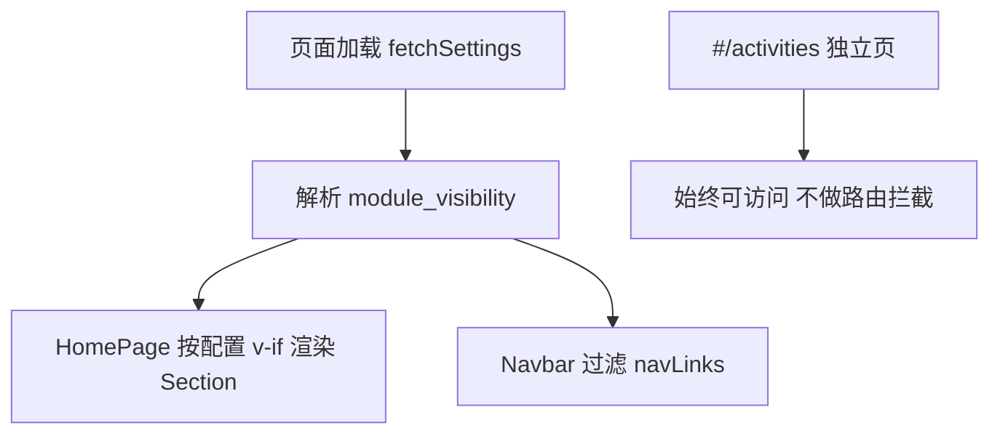

# 首页模块展示管理 — 规划

> **版本定位**：优先于 v1.2「AI 生图」需求（AI 暂缓）。确认后可作为 **v1.2.0** 或独立小版本实施。

## 背景与问题

当前管理员可以在后台维护各模块**内容**（案例、活动、设计师、能力、评价、标准、轮播、联系信息等），但**无法控制模块是否在首页展示**。

现状痛点：

- 首页 Section 在 `HomePage.vue` 里**写死**渲染，全部展示
- 导航栏 `Navbar.vue` 的锚点链接**写死**，与 Section 不完全同步
- 模块变多后，运营希望按阶段开放：例如先上「案例+联系」，活动季再开「活动」，暂时下线「标准」等
- 关闭展示后，后台仍可维护数据，随时再打开，无需删数据

## 目标

管理员在**各模块自己的管理页**里，用开关控制该模块是否在首页展示：

- 不展示的 Section 不在首页渲染
- 导航栏自动隐藏对应锚点（避免点了跳空白）
- **独立页面不受限**：例如关闭首页「活动」区块后，`#/activities` 列表/详情、分享链接仍可正常访问（仅首页 Section 和导航入口隐藏）

## 模块清单（当前首页）

| 模块 ID | 前台 Section | 导航栏 | 独立路由 | 开关放在哪个后台页 |
|---------|-------------|--------|----------|-------------------|
| `hero` | HeroSection | 首页 | 无 | **轮播图管理** |
| `stats` | StatsSection | 无 | 无 | **系统设置** |
| `cases` | CasesSection | 案例 | 无 | **案例管理** |
| `activities` | ActivitiesSection | 活动 | `#/activities`（不关） | **活动管理** |
| `designers` | DesignersSection | 设计师 | 无 | **设计师管理** |
| `capabilities` | CapabilitiesSection | 能力 | 无 | **能力管理** |
| `reviews` | ReviewsSection | 评价 | 无 | **评价管理** |
| `standards` | StandardsSection | 标准 | 无 | **标准管理** |
| `contact` | ContactSection | 联系我们 | 无 | **系统设置** |

说明：

- `hero`、`contact` **不允许关闭**（开关禁用 + 提示「首页必备」）
- `stats` 无独立内容管理页，开关放在系统设置顶部区域

## 产品形态（已确认）

### 后台入口 — 各管理页内嵌开关，不单独做页面

每个相关管理页顶部（标题栏下方或 `admin-header` 右侧）增加一行：

```
[ 在首页展示 ]  ○——●   关闭后首页不显示该模块，导航栏同步隐藏；内容仍可在此维护。
```

| 页面 | 控制模块 |
|------|----------|
| `BannersManage.vue` | `hero`（禁用关闭） |
| `CasesManage.vue` | `cases` |
| `ActivitiesManage.vue` | `activities` |
| `DesignersManage.vue` | `designers` |
| `CapabilitiesManage.vue` | `capabilities` |
| `ReviewsManage.vue` | `reviews` |
| `StandardsManage.vue` | `standards` |
| `SettingsManage.vue` | `stats`、`contact`（contact 禁用关闭） |

切换开关 → 立即调用 `PUT /api/settings` 更新 `module_visibility` 中对应字段 →  toast「已保存」。

**不新增**侧边栏「首页模块」菜单，**不新增**独立路由页。

### 前台行为



1. **HomePage**：每个 Section 包一层 `v-if="appStore.isModuleVisible('xxx')"`
2. **Navbar**：`navLinks` 改为 computed，只保留可见模块 + 固定「联系我们」
3. **活动独立页**：**不做任何限制**，分享链接 `#/activities/:id`、`/share/activities/:id` 照常可用

### 数据存储

沿用现有 `settings` 表，Key：`module_visibility`，Value 为 JSON 字符串：

```json
{
  "hero": true,
  "stats": true,
  "cases": true,
  "activities": true,
  "designers": true,
  "capabilities": true,
  "reviews": true,
  "standards": true,
  "contact": true
}
```

缺省：key 不存在时**全部视为 true**（兼容老环境）。

## 范围边界

| 做 | 不做 |
|----|------|
| 首页 Section 显隐 | 后台侧边栏菜单显隐 |
| 导航栏锚点联动 | 限制活动/分享等独立路由 |
| 各管理页内嵌开关 | 单独「首页模块」整页 |
| 独立可复用 Toggle 组件 | Footer 改造 |
| settings JSON 存储 | 拖拽排序（后续再说） |

## 已确认决策

| 项 | 结论 |
|----|------|
| 活动独立页 | **不限制**，关首页区块不影响 `#/activities` |
| 后台入口 | **各模块管理页内开关**，不单独开页 |
| Hero / 联系 | 不允许关闭 |
| Stats | 开关放在系统设置 |

## 验收标准

1. 在「标准管理」关闭「在首页展示」→ 前台首页无标准 Section，导航无「标准」
2. 在「活动管理」关闭展示 → 首页无活动 Section、导航无「活动」，但 `#/activities/1` 和分享页仍可打开
3. 在「案例管理」重新打开 → 刷新首页恢复
4. 轮播图管理、系统设置里「联系」开关不可关闭
5. 各管理页改内容不受影响

## 与 v1.2 AI 生图的关系

- 本需求与 AI 生图无依赖，可先做
- AI 生图继续暂缓

## 文档索引

- 程序设计见 [03-首页模块展示管理-程序设计.md](./03-首页模块展示管理-程序设计.md)
